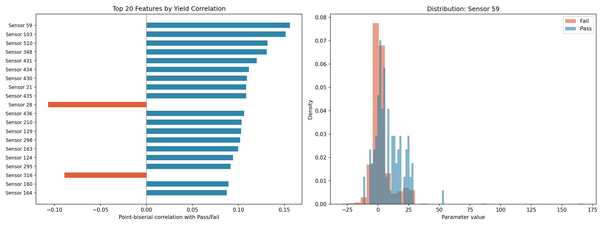
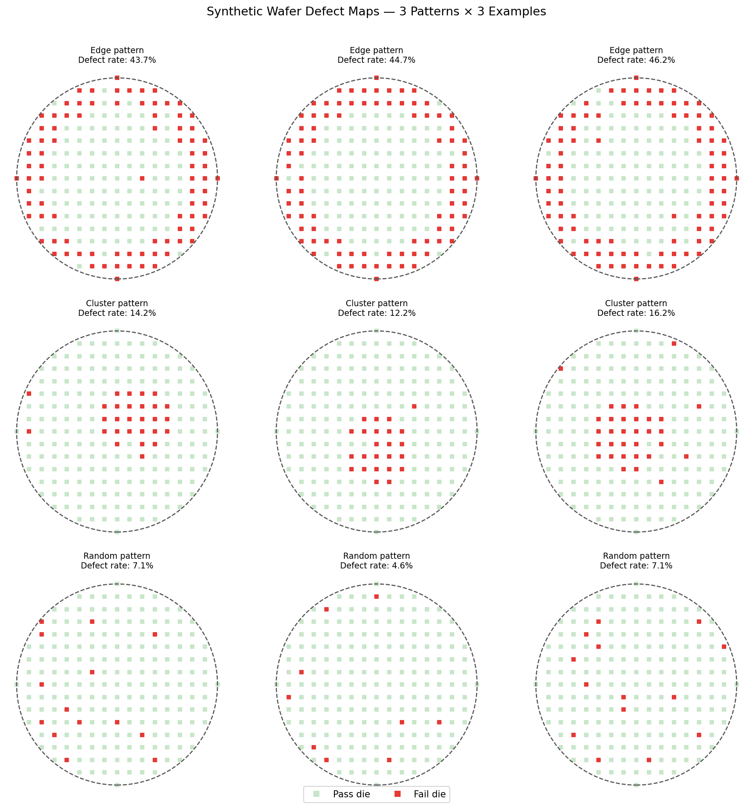
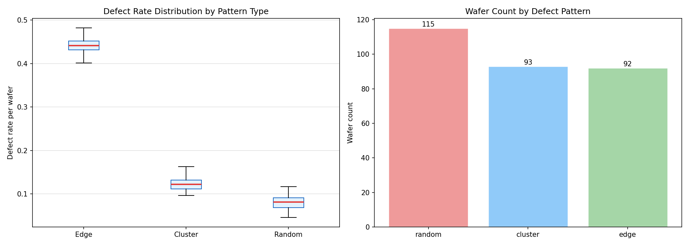
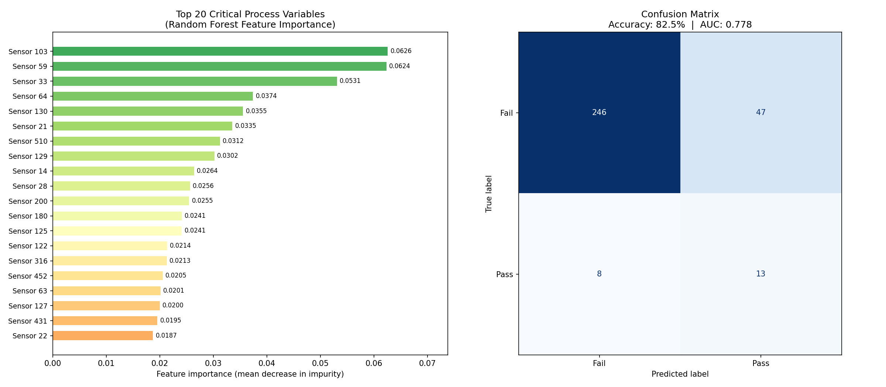
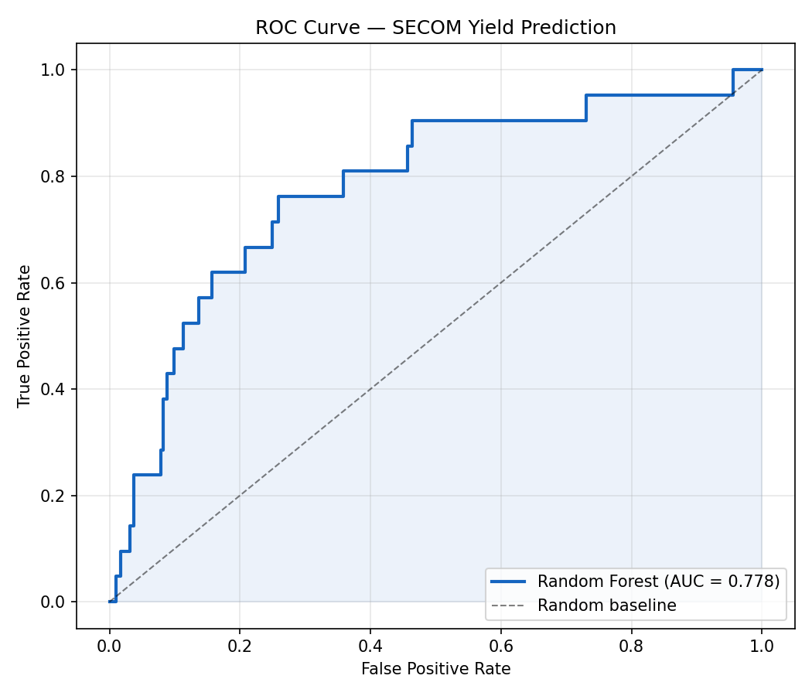
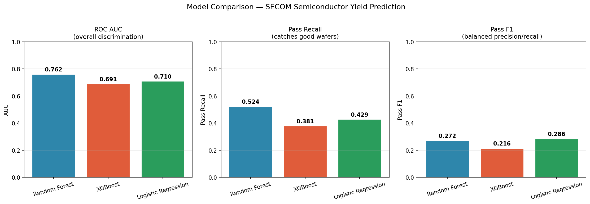

# Wafer Yield Analysis & Defect Pattern Classification

Semiconductor process analysis on the [SECOM dataset](https://archive.ics.uci.edu/dataset/179/secom)
(UCI ML Repository) — identifying yield-limiting sensor parameters and predicting
pass/fail outcomes across 1,567 wafer runs using Python, Pandas, and Scikit-learn.

---

## Problem

A semiconductor fab records 590 sensor readings per wafer — temperature, pressure,
gas flow, spin speed, and more. At the end of fabrication, each wafer either passes
or fails electrical testing. The goal: **which sensors predict failure early?**

The core challenge is severe class imbalance — only **6.6% of wafers pass**
(104 out of 1,567). A naive model predicting all-fail scores 93% accuracy while
catching zero good wafers. This project handles that correctly.

---

## Dataset

| Property | Value |
|---|---|
| Source | UCI ML Repository — SECOM |
| Wafer runs | 1,567 |
| Raw sensor parameters | 590 |
| Features after cleaning | 442 |
| Pass rate | 6.6% (104 pass / 1,463 fail) |
| Missing values | 4.5% |

---

## Repository Structure

```
├── secom_analysis.ipynb        # Full Colab notebook — run top to bottom
├── correlation_analysis.png
├── wafer_maps.png
├── yield_trends.png
├── random_forest_results.png
├── roc_curve.png
└── model_comparison.png
```

---

## Methodology

### 1. Data Cleaning
- Dropped columns with >40% missing values: 590 → 558 features
- Imputed remaining NaNs with column median
- Removed zero-variance columns: 558 → 442 usable features

### 2. Correlation Analysis
Computed point-biserial correlation between each sensor and pass/fail label.
Selected top 50 features by absolute correlation for modelling.



Top finding: Sensor 103 and Sensor 59 showed the strongest association with yield
outcome (importance ~0.063 each in the final model).

### 3. Synthetic Wafer Map Classification
Generated 300 synthetic wafer maps to demonstrate understanding of spatial defect
patterns. Built a rule-based classifier using nearest-neighbour distance analysis
to distinguish three defect types:



| Pattern | Precision | Recall | F1-score |
|---|---|---|---|
| Edge | 1.00 | 1.00 | 1.00 |
| Cluster | 1.00 | 0.41 | 0.58 |
| Random | 0.68 | 1.00 | 0.81 |
| **Overall accuracy** | | | **81.7%** |

Edge defects show the highest defect rate (~45%), followed by cluster (~12%)
and random (~8%):



### 4. ML Modelling — Handling Class Imbalance

Two techniques applied to address the 6.6% pass rate:

**SMOTE** (Synthetic Minority Oversampling) — synthesised new Pass examples
by interpolating between real ones, balancing training data from
83 → 1,170 Pass samples.

**Threshold tuning** — lowered decision threshold from default 0.50 → 0.28,
since the model never reaches 50% confidence on a class it sees so rarely.

---

## Results

### Random Forest — Primary Model



| Metric | Value |
|---|---|
| Test Accuracy | 82.5% |
| ROC-AUC | 0.778 |
| Pass Recall | 62% (13/21 passing wafers caught) |
| Optimal threshold | 0.28 (default 0.50) |

5-fold stratified cross-validation confirmed generalisation:

| Fold | AUC |
|---|---|
| 1 | 0.703 |
| 2 | 0.744 |
| 3 | 0.768 |
| 4 | 0.786 |
| 5 | 0.706 |
| **Mean** | **0.741 ± 0.033** |

### ROC Curve



### Model Comparison (Random Forest vs XGBoost vs Logistic Regression)

All three models trained on SMOTE-balanced data with tuned thresholds:



| Model | AUC | Pass Recall | Pass F1 |
|---|---|---|---|
| **Random Forest** | **0.762** | **0.524** | 0.272 |
| Logistic Regression | 0.710 | 0.429 | **0.286** |
| XGBoost | 0.691 | 0.381 | 0.216 |

Random Forest wins on AUC and Pass Recall — the two metrics that matter most
in a manufacturing context.

---

## Why accuracy is the wrong metric here

A model that predicts "Fail" for every wafer scores **93.4% accuracy** while
catching **zero passing wafers** — useless in production.

AUC of 0.778 means: given one random passing wafer and one random failing wafer,
the model correctly ranks the passing wafer as more likely to pass **77.8% of
the time**. Pass Recall of 62% means it saves 13 out of every 21 good wafers
from being incorrectly scrapped.

---

## Tech Stack

| Library | Purpose |
|---|---|
| pandas, numpy | Data loading, cleaning, feature engineering |
| scipy | Point-biserial correlation analysis |
| scikit-learn | Random Forest, Logistic Regression, cross-validation, SMOTE |
| xgboost | Gradient boosted trees comparison |
| imbalanced-learn | SMOTE oversampling |
| matplotlib, seaborn | All visualisations |

---

## How to Run

1. Open `secom_analysis.ipynb` in [Google Colab](https://colab.research.google.com)
2. Run all cells top to bottom — no setup needed
3. Dataset downloads automatically from UCI ML Repository
4. All 6 output charts save automatically to the Colab file system
